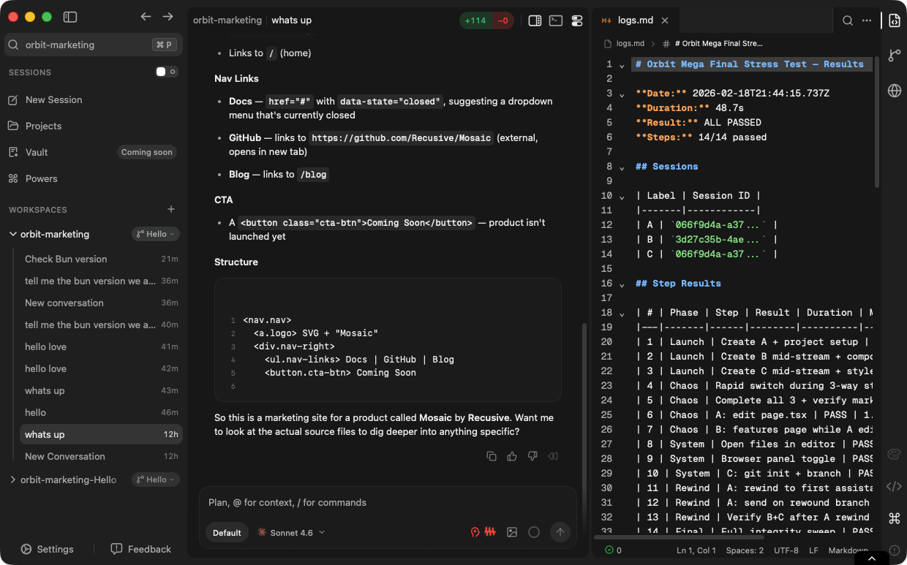

  

<h1 align="center">Orbit</h1>

  <strong>The agent-native development environment.</strong>

  Direct agents. Review changes. Design visually. Ship without switching tools.

  
  
  

---

## Download

| Platform | Architecture | Download |
|----------|-------------|----------|
| macOS | Apple Silicon (M1+) | [`.dmg`](https://github.com/Recusive/Orbit-Release/releases/latest) |

> Windows and Linux support coming soon.

All versions available on the [**Releases**](https://github.com/Recusive/Orbit-Release/releases) page.

  <picture>
    <source media="(prefers-color-scheme: dark)" srcset="release.png" />
    <source media="(prefers-color-scheme: light)" srcset="release-white.png" />
    
  </picture>

---

## What is Orbit?

The developer's job has changed. AI agents write most of the code now — your job is to direct, review, steer, and design. But every tool still puts a text editor front and center.

Orbit is a development environment built from scratch for this new workflow. Not an IDE with AI bolted on. Not a terminal with a chat window. A dedicated workspace where you orchestrate agents, review their output, and build visually.

---

## What You Get Today

### AI Agent
Chat-driven coding agent with full access to your filesystem, terminal, and git. Conversational context across your entire codebase. Rewind to any point in a conversation and fork a new direction.

### Code Editor
CodeMirror 6 with syntax highlighting, language server support, and custom themes. Dark and light mode.

### Embedded Browser
Live preview of your running app directly inside Orbit. No switching to Chrome.

### Source Control
Built-in git integration with diff view. See what changed, stage, commit.

### Terminal
Integrated terminal with full PTY support. Run your dev server, install packages, anything.

### File Explorer
Navigate and manage your project files without leaving the workspace.

### Component Builder
Browse, customize, and export shadcn/ui components. Live preview with props inspector.

---

## The Vision

Orbit is early. Here's where it's headed:

- **Agent steering** — Redirect agents mid-task without killing them. See their plan, nudge when they go wrong.
- **Review-first workflow** — Changes grouped by feature, not file. Per-hunk accept/reject. Agent explains *why*, not just *what*.
- **Multi-agent orchestration** — Run parallel agents with conflict detection and a mission control dashboard.
- **Visual canvas** — Draw UI frames, tag AI to fill them, export production code using your project's components.
- **Provider-agnostic models** — Bring your own keys for Claude, GPT, Gemini, or any model. Switch with one click.
- **MCP integrations** — Slack, Linear, GitHub with native UI panels — not just chat commands.
- **Live annotation** — Point at elements in the running app to direct agents visually.

---

## Built With

- [Tauri 2](https://tauri.app/) — Rust backend, native desktop performance
- [React 19](https://react.dev/) + TypeScript
- [CodeMirror 6](https://codemirror.net/) — Code editing

## Requirements

- **macOS** 11.0 (Big Sur) or later — Apple Silicon (M1+)

## Feedback

Found a bug or have a feature request? Open an [issue](https://github.com/Recusive/Orbit-Release/issues).

---

  Built by <a href="https://github.com/Recusive">Recursive</a>

